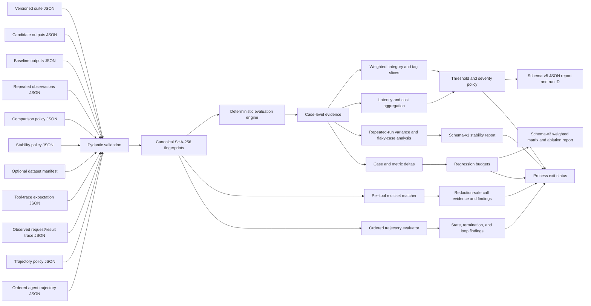
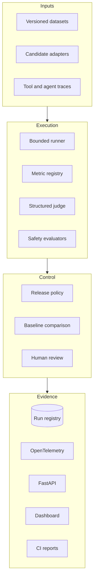

# Architecture

EvalForge starts with a deterministic, offline release gate and expands toward a vendor-neutral evaluation control plane. Documentation distinguishes implemented behavior from planned components.

## Implemented baseline

The engine selects normalized exact, substring, or bounded regular-expression scoring from an explicit metric registry. Regular expressions are limited to 256 characters and reject repetition, grouping, alternation, and optional operators, keeping matching work bounded by the existing input limits. It validates non-empty suites, unique case IDs, one output per registered case, finite thresholds in the closed interval from zero to one, positive finite weights, bounded labels, and unique case tags. Effective score thresholds resolve in this order: case override, metric override, then suite default. Legacy suites retain exact matching with a threshold and weight of one. Structured outputs are all-or-none across a suite, and complete evidence always produces deterministic totals and ceiling averages. Optional resource policies require every case to carry strict non-negative integer latency in milliseconds and cost in micro-US dollars. They gate inclusive total, ceiling-average, and nearest-rank percentile limits; missing or partial evidence fails closed. Per-case measurements and aggregate totals must each remain within the maximum JSON-safe integer; aggregate overflow is invalid input rather than rounded, clamped, or serialized imprecisely. Reports preserve input order, threshold sources, normalized evidence, quality dimensions, weighted aggregate evidence, sorted category/tag slices, per-case performance, deterministic resource aggregates, and machine-readable quality or resource failures.

The comparison engine evaluates the same ordered suite against baseline and candidate outputs, including structured performance evidence whenever it is supplied, then emits candidate-minus-baseline case deltas and weighted metric means in registry order. Absolute and relative regression budgets are checked independently for overall weighted pass rate and each represented metric's weighted mean. Zero baselines have an explicit `null` relative delta and cannot produce a score regression. Model-matrix rows are always baseline then candidate and expose weighted pass rates and weighted metric means; ablation counts remain raw ordered case-status counts.

The stability engine evaluates one to 1,000 uniquely named observations against the same suite policy. It preserves run order, computes weighted pass-rate mean/minimum/maximum and population variance, and records suite-ordered case pass/fail counts. A case is flaky only when its Boolean gate outcome changes across runs. Configurable inclusive limits gate variance and the fraction of flaky cases; every individual run must also pass the suite quality and resource gates. One-run analysis is valid with zero variance and no flaky cases.

The tool-trace engine validates strict versioned request/result exchanges, matching call IDs, unique observed call IDs, a unique allowlist, and expected calls restricted to that allowlist. It treats each tool's calls as an unordered multiset while retaining observed order in report evidence. Pairing deterministically prioritizes complete canonical argument/result matches, then argument matches, result matches, and stable indices. Comparisons use type-strict canonical JSON identity and report missing, extra, repeated, disallowed, argument-mismatch, and result-mismatch findings. Evidence contains canonical SHA-256 digests rather than raw arguments or results; these digests support integrity checks but are not a confidentiality mechanism for low-entropy values. Deterministic precision, recall, component match counts, and a semantics-bound trace ID support release gating.

The trajectory engine evaluates a strict versioned policy against an ordered sequence of state transitions. It requires an exact positional transition sequence, verifies initial-state and cross-step continuity, blocks explicitly forbidden transitions, and checks that termination occurs only on the final step in an allowed terminal state. Revisiting a state is counted deterministically and either reported as a loop finding or allowed by policy. Findings retain rule and step indices plus state names, but omit action payloads. Canonical policy and trace digests plus an explicit semantics version bind the CLI's deterministic trajectory ID.

The CLI bounds each untrusted JSON file to 1 MiB, 64 nesting levels, 100,000 decoded nodes, 65,536 characters per string, and 256 characters per numeric literal. It rejects duplicate keys, non-finite constants, coercive threshold or resource-evidence types, ambiguous legacy/declarative policies, invalid comparison budgets, and invalid Unicode before evaluation. Canonicalization operates on successfully validated raw JSON values before typed-model normalization, using sorted keys, compact separators, UTF-8 encoding, non-finite-number rejection, and negative-zero normalization before computing SHA-256 digests. Every schema-version-5 evaluation report records suite and candidate digests, canonicalization and evaluator-semantics versions, a run ID bound to that complete preimage, effective thresholds and sources, weighted slice summaries, deterministic resource evidence, and machine-readable gate failures. Schema-version-3 comparison reports include two full schema-version-5 evaluations, the policy and its digest, all input digests, weighted regression evidence, deterministic deltas, matrix and ablation evidence, and a content-addressed comparison ID whose preimage is versioned at `3` and binds canonicalization semantics. Evaluator-semantics version `3` binds resource-gate behavior and includes the runtime Unicode database version used by trimming and case folding. An optional strict, versioned dataset manifest records source lineage and binds it to the suite digest; mismatches fail closed before evaluation. Reports retain only its digest and a minimal dataset ID, version, and license summary so private source locations and creator identities are not propagated.

## Target architecture

## Design boundaries

- **Deterministic by default:** core tests and examples make no network calls.
- **Fail closed:** empty or duplicate repeated observations, malformed or duplicate tool-call IDs, disallowed or unmatched calls, invalid or discontinuous trajectory steps, forbidden transitions, premature or missing termination, disallowed loops, missing or partial resource evidence, aggregate resource overflow, ambiguous policies, unsafe regular expressions, invalid thresholds or measurements, and mismatched case IDs stop evaluation.
- **Evidence before verdict:** aggregate decisions retain ordered case-level results; tool-trace reports retain ordered call metadata and value digests without copying raw arguments or results; trajectory reports retain ordered rule/step findings without action payloads.
- **Provider isolation:** future model adapters remain outside the metric and policy core.
- **No secret persistence:** credentials are supplied at runtime and never written to reports.
- **Reproducibility:** canonical suite, baseline, candidate, policy, and optional manifest hashes plus explicit algorithm and evaluator-semantics versions identify every run or comparison; manifests retain source lineage without requiring provider access.

See [ROADMAP.md](../ROADMAP.md) for implementation status.
