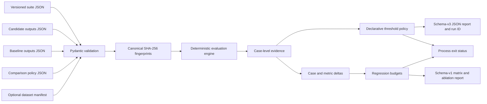
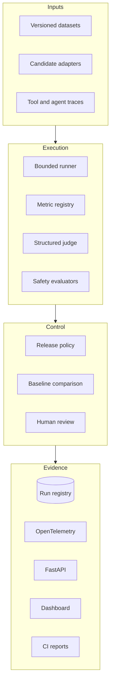

# Architecture

EvalForge starts with a deterministic, offline release gate and expands toward a vendor-neutral evaluation control plane. Documentation distinguishes implemented behavior from planned components.

## Implemented baseline

The engine selects normalized exact, substring, or bounded regular-expression scoring from an explicit metric registry. Regular expressions are limited to 256 characters and reject repetition, grouping, alternation, and optional operators, keeping matching work bounded by the existing input limits. It validates non-empty suites, unique case IDs, one output per registered case, and finite thresholds in the closed interval from zero to one. Effective score thresholds resolve in this order: case override, metric override, then suite default. Legacy suites retain exact matching with a threshold of one. Reports preserve input order, threshold sources, normalized evidence, and machine-readable aggregate gate failures.

The comparison engine evaluates the same ordered suite against baseline and candidate outputs, then emits candidate-minus-baseline case deltas and metric means in registry order. Absolute and relative regression budgets are checked independently for overall pass rate and each represented metric. Zero baselines have an explicit `null` relative delta and cannot produce a score regression. Model-matrix rows are always baseline then candidate, and ablation counts are derived from ordered case statuses.

The CLI bounds each untrusted JSON file to 1 MiB, 64 nesting levels, 100,000 decoded nodes, 65,536 characters per string, and 256 characters per numeric literal. It rejects duplicate keys, non-finite constants, coercive threshold types, ambiguous legacy/declarative policies, invalid comparison budgets, and invalid Unicode before evaluation. Canonicalization operates on successfully validated raw JSON values before typed-model normalization, using sorted keys, compact separators, UTF-8 encoding, non-finite-number rejection, and negative-zero normalization before computing SHA-256 digests. Every schema-version-3 evaluation report records suite and candidate digests, canonicalization and evaluator-semantics versions, a run ID bound to that complete preimage, effective thresholds and sources, and machine-readable gate failures. Schema-version-1 comparison reports include both full evaluations, the policy and its digest, all input digests, deterministic deltas, matrix and ablation evidence, and a content-addressed comparison ID. The evaluator-semantics version includes the runtime Unicode database version used by trimming and case folding. An optional strict, versioned dataset manifest records source lineage and binds it to the suite digest; mismatches fail closed before evaluation. Reports retain only its digest and a minimal dataset ID, version, and license summary so private source locations and creator identities are not propagated.

## Target architecture

## Design boundaries

- **Deterministic by default:** core tests and examples make no network calls.
- **Fail closed:** missing evidence, ambiguous policies, unsafe regular expressions, invalid thresholds, and mismatched case IDs stop evaluation.
- **Evidence before verdict:** aggregate decisions retain ordered case-level results.
- **Provider isolation:** future model adapters remain outside the metric and policy core.
- **No secret persistence:** credentials are supplied at runtime and never written to reports.
- **Reproducibility:** canonical suite, baseline, candidate, policy, and optional manifest hashes plus explicit algorithm and evaluator-semantics versions identify every run or comparison; manifests retain source lineage without requiring provider access.

See [ROADMAP.md](../ROADMAP.md) for implementation status.
