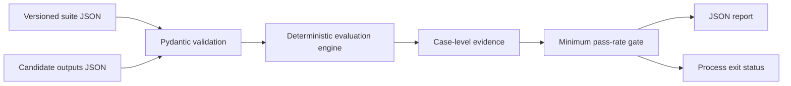
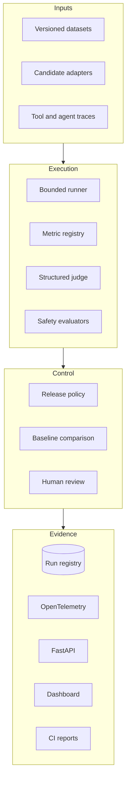

# Architecture

EvalForge starts with a deterministic, offline release gate and expands toward a vendor-neutral evaluation control plane. Documentation distinguishes implemented behavior from planned components.

## Implemented baseline

The current engine performs normalized exact matching. It validates non-empty suites, unique case IDs, one output per registered case, and a finite release threshold between zero and one. Reports preserve input case order and include expected and actual values for auditability.

## Target architecture

## Design boundaries

- **Deterministic by default:** core tests and examples make no network calls.
- **Fail closed:** missing evidence, invalid thresholds, and mismatched case IDs stop evaluation.
- **Evidence before verdict:** aggregate decisions retain ordered case-level results.
- **Provider isolation:** future model adapters remain outside the metric and policy core.
- **No secret persistence:** credentials are supplied at runtime and never written to reports.
- **Reproducibility:** schemas, dataset hashes, candidate metadata, and tool versions will identify every run.

See [ROADMAP.md](../ROADMAP.md) for implementation status.
