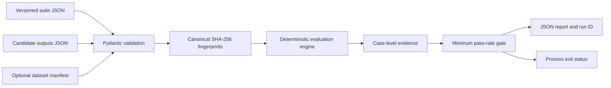
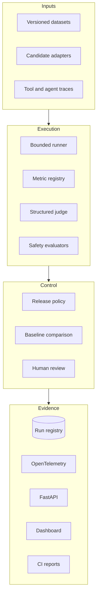

# Architecture

EvalForge starts with a deterministic, offline release gate and expands toward a vendor-neutral evaluation control plane. Documentation distinguishes implemented behavior from planned components.

## Implemented baseline

The current engine performs normalized exact matching. It validates non-empty suites, unique case IDs, one output per registered case, and a finite release threshold between zero and one. Reports preserve input case order and include expected and actual values for auditability.

The CLI bounds each untrusted JSON file to 1 MiB, 64 nesting levels, 100,000 decoded nodes, 65,536 characters per string, and 256 characters per numeric literal. It rejects duplicate keys, non-finite constants, coercive threshold types, and invalid Unicode before evaluation. Canonicalization operates on successfully validated raw JSON values before typed-model normalization, using sorted keys, compact separators, UTF-8 encoding, non-finite-number rejection, and negative-zero normalization before computing SHA-256 digests. Every schema-version-2 report records suite and candidate digests, canonicalization and evaluator-semantics versions, and a run ID bound to that complete preimage. The evaluator-semantics version includes the runtime Unicode database version used by trimming and case folding. An optional strict, versioned dataset manifest records source lineage and binds it to the suite digest; mismatches fail closed before evaluation. Reports retain only its digest and a minimal dataset ID, version, and license summary so private source locations and creator identities are not propagated.

## Target architecture

## Design boundaries

- **Deterministic by default:** core tests and examples make no network calls.
- **Fail closed:** missing evidence, invalid thresholds, and mismatched case IDs stop evaluation.
- **Evidence before verdict:** aggregate decisions retain ordered case-level results.
- **Provider isolation:** future model adapters remain outside the metric and policy core.
- **No secret persistence:** credentials are supplied at runtime and never written to reports.
- **Reproducibility:** canonical suite, candidate, and optional manifest hashes plus explicit algorithm and evaluator-semantics versions identify every run; manifests retain source lineage without requiring provider access.

See [ROADMAP.md](../ROADMAP.md) for implementation status.
