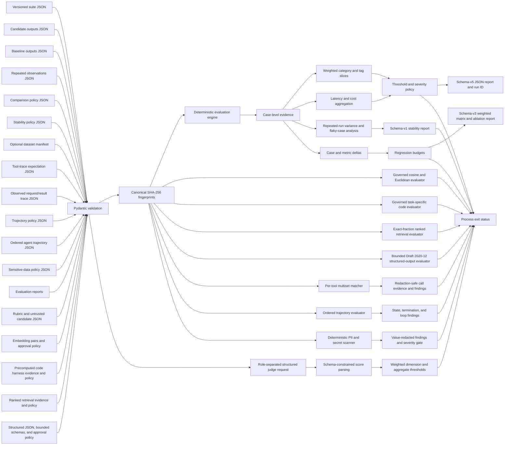
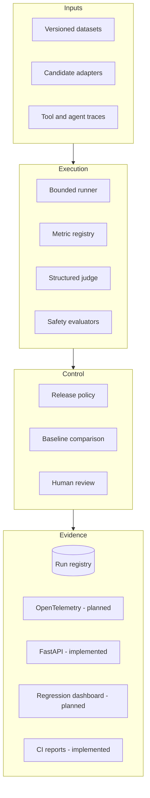

# Architecture

EvalForge v0.1.0 combines a deterministic offline release gate with an explicit provider boundary and a local evidence control plane. Documentation distinguishes implemented behavior from planned hosted components.

## Implemented baseline

```mermaid
flowchart LR
    S[Versioned suite JSON] --> V[Pydantic validation]
    O[Candidate outputs JSON] --> V
    B[Baseline outputs JSON] --> V
    N[Repeated observations JSON] --> V
    C[Comparison policy JSON] --> V
    Y[Stability policy JSON] --> V
    M[Optional dataset manifest] --> V
    U[Tool-trace expectation JSON] --> V
    K[Observed request/result trace JSON] --> V
    TP[Trajectory policy JSON] --> V
    AT[Ordered agent trajectory JSON] --> V
    SD[Sensitive-data policy JSON] --> V
    ER[Evaluation reports] --> V
    RB[Rubric and untrusted candidate JSON] --> V
    EM[Embedding pairs and approval policy] --> V
    CH[Precomputed code harness evidence and policy] --> V
    RE[Ranked retrieval evidence and policy] --> V
    SO[Structured JSON, bounded schemas, and approval policy] --> V
    V --> H[Canonical SHA-256 fingerprints]
    V --> SJ[Role-separated structured judge request]
    SJ --> JS[Schema-constrained score parsing]
    JS --> JW[Weighted dimension and aggregate thresholds]
    JW --> X
    H --> E[Deterministic evaluation engine]
    H --> ES[Governed cosine and Euclidean evaluator]
    ES --> X
    H --> CE[Governed task-specific code evaluator]
    CE --> X
    H --> REE[Exact-fraction ranked retrieval evaluator]
    REE --> X
    H --> SOE[Bounded Draft 2020-12 structured-output evaluator]
    SOE --> X
    H --> L[Per-tool multiset matcher]
    H --> TE[Ordered trajectory evaluator]
    TE --> TF[State, termination, and loop findings]
    TF --> X[Process exit status]
    H --> LS[Deterministic PII and secret scanner]
    LS --> LF[Value-redacted findings and severity gate]
    LF --> X
    L --> F[Redaction-safe call evidence and findings]
    F --> X[Process exit status]
    E --> R[Case-level evidence]
    R --> W[Weighted category and tag slices]
    R --> P[Latency and cost aggregation]
    R --> T[Repeated-run variance and flaky-case analysis]
    W --> G[Threshold and severity policy]
    P --> G
    G --> J[Schema-v5 JSON report and run ID]
    G --> X[Process exit status]
    R --> D[Case and metric deltas]
    D --> Q[Regression budgets]
    Q --> A[Schema-v3 weighted matrix and ablation report]
    T --> Z[Schema-v1 stability report]
    Z --> X
    Q --> X
```

The engine selects normalized exact, substring, or bounded regular-expression scoring from an explicit metric registry. Regular expressions are limited to 256 characters and reject repetition, grouping, alternation, and optional operators, keeping matching work bounded by the existing input limits. It validates non-empty suites, unique case IDs, one output per registered case, finite thresholds in the closed interval from zero to one, positive finite weights, bounded labels, and unique case tags. Effective score thresholds resolve in this order: case override, metric override, then suite default. Legacy suites retain exact matching with a threshold and weight of one. Structured outputs are all-or-none across a suite, and complete evidence always produces deterministic totals and ceiling averages. Optional resource policies require every case to carry strict non-negative integer latency in milliseconds and cost in micro-US dollars. They gate inclusive total, ceiling-average, and nearest-rank percentile limits; missing or partial evidence fails closed. Per-case measurements and aggregate totals must each remain within the maximum JSON-safe integer; aggregate overflow is invalid input rather than rounded, clamped, or serialized imprecisely. Reports preserve input order, threshold sources, normalized evidence, quality dimensions, weighted aggregate evidence, sorted category/tag slices, per-case performance, deterministic resource aggregates, and machine-readable quality or resource failures.

The comparison engine evaluates the same ordered suite against baseline and candidate outputs, including structured performance evidence whenever it is supplied, then emits candidate-minus-baseline case deltas and weighted metric means in registry order. Absolute and relative regression budgets are checked independently for overall weighted pass rate and each represented metric's weighted mean. Zero baselines have an explicit `null` relative delta and cannot produce a score regression. Model-matrix rows are always baseline then candidate and expose weighted pass rates and weighted metric means; ablation counts remain raw ordered case-status counts.

The stability engine evaluates one to 1,000 uniquely named observations against the same suite policy. It preserves run order, computes weighted pass-rate mean/minimum/maximum and population variance, and records suite-ordered case pass/fail counts. A case is flaky only when its Boolean gate outcome changes across runs. Configurable inclusive limits gate variance and the fraction of flaky cases; every individual run must also pass the suite quality and resource gates. One-run analysis is valid with zero variance and no flaky cases.

The tool-trace engine validates strict versioned request/result exchanges, matching call IDs, unique observed call IDs, a unique allowlist, and expected calls restricted to that allowlist. It treats each tool's calls as an unordered multiset while retaining observed order in report evidence. Pairing deterministically prioritizes complete canonical argument/result matches, then argument matches, result matches, and stable indices. Comparisons use type-strict canonical JSON identity and report missing, extra, repeated, disallowed, argument-mismatch, and result-mismatch findings. Evidence contains canonical SHA-256 digests rather than raw arguments or results; these digests support integrity checks but are not a confidentiality mechanism for low-entropy values. Deterministic precision, recall, component match counts, and a semantics-bound trace ID support release gating.

The trajectory engine evaluates a strict versioned policy against an ordered sequence of state transitions. It requires an exact positional transition sequence, verifies initial-state and cross-step continuity, blocks explicitly forbidden transitions, and checks that termination occurs only on the final step in an allowed terminal state. Revisiting a state is counted deterministically and either reported as a loop finding or allowed by policy. Findings retain rule and step indices plus state names, but omit action payloads. Canonical policy and trace digests plus an explicit semantics version bind the CLI's deterministic trajectory ID.

The sensitive-data engine applies fixed, bounded detectors to candidate output text or recursively to string values in evaluation reports. It recognizes common email, North American phone, structurally valid US SSN, Luhn-valid payment-card, labeled or common-prefixed API-key, and PEM private-key patterns. Policies select categories, override severities, choose blocking severities, and suppress exact known false positives with SHA-256 digests. Findings retain only a string index, category, and severity; matched text, caller IDs, keys, and source content are excluded. Canonical input and policy digests plus a Unicode-bound semantics version provide deterministic scan identity but are not confidentiality controls for low-entropy values.

The structured-judge boundary validates strict versioned rubrics, dimensions, evaluations, score responses, and reports. It places trusted rubric criteria in the system message and canonicalizes task and candidate text into a single untrusted JSON value in the user message, so embedded output text cannot create new prompt records or alter the trusted instruction channel. Each request carries a rubric-specific Draft 2020-12 JSON Schema with fixed ordered dimension IDs. Independent parsing rejects duplicate keys, coercive scores, unknown fields, invalid Unicode, oversized responses, and any dimension mismatch before aggregation. Reports expose each score, weight, contribution, inclusive dimension threshold, weighted aggregate, inclusive aggregate threshold, and final gate. Repeated label-blinded calibration, position and verbosity probes, deterministic review selection, portable redacted queues, decision import, and adjudication summaries are implemented around the same boundary. A production live judge adapter, multi-judge quorum service, and hosted reviewer UI remain outside v0.1.0.

The embedding-similarity boundary accepts precomputed vectors only; it never downloads or executes a model. Strict provenance records provider, model ID, revision, dimensions, artifact SHA-256, and license. A separate policy approves the canonical digest of that complete normalized provenance, preventing vectors from an unapproved model or revision from being compared under the same gate. Bounded finite nonzero vectors are first scaled by their maximum absolute coordinate, then produce direction-preserving cosine similarity with `math.hypot`/`math.fsum`, exact-rational proportionality checks before assigning endpoint values, non-endpoint rounding toward the interior, exact-rational threshold decisions over the original coordinates, and Euclidean distance with `math.dist`; cosine controls the per-case threshold and aggregate pass rate. Reports retain public model identity, metric values, and vector digests while omitting raw vectors. Canonical evaluation and policy digests plus explicit algorithm semantics form a deterministic evaluation ID.

The task-specific code boundary evaluates precomputed terminal outcomes and never reads, imports, compiles, or executes candidate code. Evidence binds a candidate artifact digest to an approved harness artifact, runtime artifact, producer, and revision. Policies require an exact ordered case set and an inclusive pass-rate threshold expressed as bounded integer numerator/denominator fields; integer cross-multiplication avoids floating-point decision aliases. Only `passed` contributes to the pass rate; harness `error`, `timeout`, and `skipped` outcomes independently block release. Reports omit source, commands, paths, logs, and exception text. The evaluation ID binds canonical evidence, policy, and complete validated-report digests. Content-addressed identity proves which JSON evidence was evaluated, not that the trusted producer executed the claimed candidate or enforced a strong sandbox.

The ranked-retrieval boundary evaluates precomputed relevance judgments and ordered result IDs without querying a live index. Provenance binds producer/revision plus retriever, corpus, and index artifact digests; policy approves that normalized identity and requires an exact ordered case set. Precision@k, recall@k, and reciprocal rank are accumulated as exact fractions and compared with canonical reduced rational thresholds. Reports retain only case IDs, counts, first-hit ranks, diagnostics, and exact aggregate fraction strings—not document IDs. Canonical evaluation, policy, and validated-report digests plus fixed semantics produce a deterministic retrieval evaluation ID.

The structured-output boundary validates candidate JSON against an approved ordered catalog of schemas under a deliberately bounded Draft 2020-12 profile. It supports deterministic object, array, scalar, enum, constant, and finite range constraints while rejecting references, regular-expression keywords, combinators, remote resolution, unknown keywords, and coercive limits. Canonical schema ordering makes diagnostics deterministic; collection, nesting, file, string, numeric, and diagnostic-count limits bound work. Exact reduced pass-rate fractions decide release. Reports retain case IDs, schema/candidate digests, validity, capped violation counts, truncation flags, and validator categories, but omit raw schemas, paths, keys, and values. Canonical evaluation, policy, and validated-report digests plus fixed profile semantics produce a deterministic structured-output evaluation ID.

The CLI bounds each untrusted JSON file to 1 MiB, 64 nesting levels, 100,000 decoded nodes, 65,536 characters per string, and 256 characters per numeric literal. It rejects duplicate keys, non-finite constants, nonzero literals that underflow binary64, coercive threshold or resource-evidence types, ambiguous legacy/declarative policies, invalid comparison budgets, and invalid Unicode before evaluation. Embedding parsing, validation, evaluation, and report construction run in a helper that returns only pass-rate and gate status after sensitive frames unwind; sanitized CLI errors and exits therefore do not retain raw vectors in traceback locals or exception chains. Canonicalization operates on successfully validated raw JSON values before typed-model normalization, using sorted keys, compact separators, UTF-8 encoding, non-finite-number rejection, and negative-zero normalization before computing SHA-256 digests. Every schema-version-5 evaluation report records suite and candidate digests, canonicalization and evaluator-semantics versions, a run ID bound to that complete preimage, effective thresholds and sources, weighted slice summaries, deterministic resource evidence, and machine-readable quality or resource failures. Schema-version-3 comparison reports include two full schema-version-5 evaluations, the policy and its digest, all input digests, weighted regression evidence, deterministic deltas, matrix and ablation evidence, and a content-addressed comparison ID whose preimage is versioned at `3` and binds canonicalization semantics. Evaluator-semantics version `3` binds resource-gate behavior and includes the runtime Unicode database version used by trimming and case folding. An optional strict, versioned dataset manifest records source lineage and binds it to the suite digest; mismatches fail closed before evaluation. Reports retain only its digest and a minimal dataset ID, version, and license summary so private source locations and creator identities are not propagated.

The local control plane places `EvalForgeService` between the API and a transactional SQLite `RunRegistry`. It registers canonical suites, runs the same deterministic engine, and stores immutable reports under deterministic IDs. Versioned FastAPI routes expose bounded suite/run lists and report retrieval. The basic dashboard renders only run summaries with escaped metadata and report links; candidate text is excluded. The container runs as a non-root user and the default Compose mapping is loopback-only. Authentication, multi-tenancy, a full regression analytics dashboard, and distributed execution are post-v0.1.0 work.

## Control-plane direction

```mermaid
flowchart TB
    subgraph Inputs
      D[Versioned datasets]
      C[Candidate adapters]
      T[Tool and agent traces]
    end
    subgraph Execution
      Q[Bounded runner]
      M[Metric registry]
      J[Structured judge]
      S[Safety evaluators]
    end
    subgraph Control
      P[Release policy]
      B[Baseline comparison]
      H[Human review]
    end
    subgraph Evidence
      DB[(Run registry)]
      OT[OpenTelemetry - planned]
      API[FastAPI - implemented]
      UI[Regression dashboard - planned]
      CI[CI reports - implemented]
    end
    Inputs --> Execution --> Control --> Evidence
```

## Design boundaries

- **Deterministic by default:** core tests and examples make no network calls.
- **Fail closed:** empty candidate-output scans, duplicate or malformed policy controls, blocking sensitive-data findings, empty or duplicate repeated observations, malformed or duplicate tool-call IDs, disallowed or unmatched calls, invalid or discontinuous trajectory steps, forbidden transitions, premature or missing termination, disallowed loops, missing or partial resource evidence, aggregate resource overflow, ambiguous policies, unsafe regular expressions or schema keywords, invalid thresholds or measurements, unapproved schema catalogs, and mismatched case IDs stop evaluation.
- **Evidence before verdict:** aggregate decisions retain ordered case-level results; tool-trace reports retain ordered call metadata and value digests without copying raw arguments or results; trajectory reports retain ordered rule/step findings without action payloads.
- **Provider isolation:** networked provider adapters remain outside the metric and policy core; offline fakes exercise the same typed boundary.
- **No secret persistence:** credentials are supplied at runtime and never written to reports; sensitive-data findings omit matched values and use digest-only allowlists.
- **Reproducibility:** canonical suite, baseline, candidate, policy, and optional manifest hashes plus explicit algorithm and evaluator-semantics versions identify every run or comparison; manifests retain source lineage without requiring provider access.

See [ROADMAP.md](../ROADMAP.md) for implementation status.
