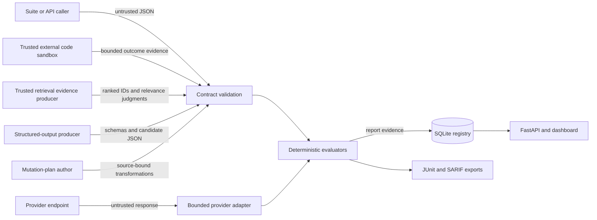

# EvalForge threat model

## Scope and deployment assumptions

This threat model covers the v0.1.0 CLI, provider adapter, deterministic evaluators, SQLite run registry, FastAPI service, read-only run dashboard, CI exports, and container image. The supported default deployment is a single trusted operator on a local machine or private CI runner. The Compose example binds to loopback.

EvalForge v0.1.0 does **not** provide authentication, authorization, tenant isolation, TLS termination, distributed rate limiting, or encrypted database storage. An operator who exposes it beyond loopback must supply those controls with an authenticated reverse proxy and platform policy.

## Assets

- Provider API credentials and authorization headers
- Prompts, expected answers, candidate outputs, traces, and rubric content
- Dataset lineage and content-addressed evidence
- Evaluation and safety reports used to approve or block a release
- Candidate code artifacts and precomputed code-harness evidence
- Retriever, corpus, index, relevance-judgment, and ranked-result evidence
- Structured-output schemas, candidate JSON values, and schema-validation release evidence
- Source suites, adversarial mutation plans, and generated prompt datasets
- SQLite registry integrity and availability
- CI check results, JUnit, and SARIF artifacts
- The host filesystem and network reachable by the EvalForge process

## Threat actors

- An untrusted model or agent emitting adversarial output
- A malicious or compromised suite/report author
- An unauthenticated network client when an operator exposes the API
- A compromised provider endpoint or DNS/network path
- A contributor attempting supply-chain or CI compromise
- A local user with access to the process account or database file

## Trust boundaries and data flow

1. **Caller to parser/API.** JSON, path arguments, suite definitions, regular expressions, traces, and output text are attacker-controlled. Limits and strict schemas must run before expensive work.
2. **Process to provider network.** Provider URLs, DNS answers, redirects, response size, latency, and response JSON are not trusted. Credentials cross this boundary only in authorization headers.
3. **Evaluation engine to persistence.** Reports may contain sensitive business evidence. SQLite provides local durability, not confidentiality or multi-writer service guarantees.
4. **Persistence to API/dashboard.** API clients can observe persisted metadata and reports. Dashboard fields require HTML escaping. Summary views deliberately omit candidate text.
5. **Reports to CI and GitHub.** JUnit and SARIF become externally visible artifacts or annotations. They must contain bounded, redacted evidence rather than raw sensitive values.
6. **Repository to CI/container.** Dependencies, Actions, build context, and generated files can affect release integrity. Locking, immutable Action references, minimal build context, and a non-root runtime reduce exposure.
7. **External code harness to evaluator.** Candidate code is untrusted, but its sandbox and evidence producer are trusted. EvalForge validates provenance, exact case accounting, and terminal outcomes; it does not execute code or attest sandbox controls.
8. **Retrieval producer to evaluator.** The producer supplies relevance judgments and ranked IDs under approved retriever/corpus/index provenance. EvalForge recomputes metrics but does not attest corpus completeness, judgment quality, or that the claimed artifacts produced the supplied ranking.
9. **Structured-output producer to evaluator.** Candidate values and schemas are untrusted. EvalForge permits only a bounded, reference-free schema profile, approves the exact ordered schema catalog by digest, and emits value-redacted validation evidence; it does not prove that a schema captures the product's complete semantic contract.
10. **Mutation-plan author to generator.** Mutation text, source-case references, and character positions are untrusted. EvalForge binds plans to normalized source suites, bounds cardinality and text, applies fixed deterministic operators, and re-derives artifact evidence; generated prompts remain sensitive controlled data.

## Threats and controls

| Threat | Relevant controls | Residual risk |
|---|---|---|
| Malformed, ambiguous, deeply nested, or oversized JSON | Byte/depth/node/string/number limits; duplicate-key rejection; strict Pydantic models; finite numeric checks | A new parser or route can bypass shared limits unless contract tests cover it |
| Denial of service through expensive regular expressions or oversized suites | Bounded regex grammar/length, finite model cardinality, bounded provider/report responses, and container concurrency/resource limits | API-wide body-size, processing-deadline, distributed rate-limit, and per-client quota controls are external in v0.1.0 |
| Prompt injection or malicious model output | Provider output is treated as data; deterministic metrics do not execute it; dashboard escapes metadata; reports avoid HTML interpretation | A human reviewer or downstream system can still be socially engineered by raw output it chooses to inspect |
| Sensitive-data leakage into evidence | Deterministic leakage scanner; redacted finding metadata; summary/dashboard omit candidate text; SARIF avoids matched values | Pattern detection is not a complete DLP system and can miss novel secrets or produce false positives |
| Credential disclosure | Environment-only provider credentials; generic `ProviderError`; no secret values in reports; repository secret scan | Environment and process inspection remain privileged local risks |
| SSRF or provider endpoint abuse | Operator-supplied HTTP(S) origin rejects URL credentials/query/fragment; direct transport does not follow redirects; connect/read/overall deadlines and response bytes are bounded | HTTP remains supported for trusted local endpoints, and DNS/IP egress validation is external in v0.1.0 |
| SQL injection or registry corruption | Parameterized SQLite statements; typed repository methods; deterministic IDs; transactions and schema checks | The local database is not protected from a user who can modify the file directly |
| Cross-site scripting in the dashboard | HTML escaping, no candidate text, restrictive Content Security Policy, `nosniff`, no-store | The dashboard has no authentication; reverse-proxy headers and origin policy are deployment responsibilities |
| Unauthorized evaluation or report access | Loopback-only Compose default and documented private-use assumption | Authentication and authorization are absent from v0.1.0 |
| False release approval | Fail-closed thresholds, exact evidence cardinality, strict integers, provenance digests, deterministic IDs, tests across gate failures | Deterministic metrics can be incomplete proxies for product quality; human review remains necessary |
| Forged or incomplete code-test evidence | Approved producer/runtime provenance digest, exact ordered required-case accounting, blocking infrastructure outcomes, content-addressed candidate/evidence IDs | JSON evidence is not a signed execution attestation; producer compromise or weak sandboxing remains external |
| Forged, biased, or privacy-sensitive retrieval evidence | Approved retriever/corpus/index provenance, exact case accounting, bounded unique IDs, exact-fraction gates, document-ID-free reports | The producer and relevance judgments remain trusted; low-entropy IDs may be guessed from input digests; metrics do not prove corpus completeness or factuality |
| Unsafe or privacy-sensitive structured-output validation | Reference-free bounded schema profile, exact schema-catalog approval, shared JSON limits, capped diagnostics, atomic report replacement, and value/path-redacted reports | Complex permitted schemas still consume bounded local CPU; digests of low-entropy schemas or values may be guessed; schema validity does not prove business correctness |
| Forged, unsafe, or privacy-sensitive mutation datasets | Source-suite digest approval, strict operator parameters, bounded generated contracts, deterministic re-derivation, content-addressed campaign identity, and atomic artifact replacement | Plans can contain malicious or sensitive prompt text; deterministic operators do not prove attack coverage or model safety; artifacts intentionally contain source and generated prompts |
| Supply-chain or CI tampering | Locked Python dependencies, immutable Action commit SHAs, least-privilege workflow permissions, build/test gates | PyPI, GitHub, or a dependency could still be compromised; no artifact signing/SBOM in v0.1.0 |
| Path traversal or accidental file disclosure | CLI writes to explicit operator paths; container uses a fixed application directory and non-root user | The trusted local operator can choose destructive or sensitive paths; API does not accept arbitrary output paths |

## Security invariants

- Missing, partial, non-finite, ambiguous, or out-of-range evidence fails before artifact creation.
- Evaluation identity binds suite, candidate evidence, semantics, and optional dataset lineage without publishing raw content.
- Provider and validation errors do not echo secrets, full request payloads, or provider response bodies.
- Candidate output is not rendered in run lists or the dashboard.
- Security findings report category and location metadata, not matched sensitive values.
- CI and release workflows require no provider credential for the synthetic acceptance path.

## Residual risks and non-goals

- **Authentication and multi-tenancy:** not implemented. The API is not an internet-facing multi-user service.
- **Encryption at rest:** not implemented. Protect the database and artifacts with OS and CI permissions.
- **Sandboxing model output:** EvalForge does not execute model text, but it cannot control downstream consumers.
- **Candidate-code execution:** not implemented by design. A trusted external harness must isolate untrusted code with network, filesystem, process, CPU, memory, and wall-time controls.
- **Perfect safety detection:** deterministic patterns and metrics are evidence, not proof of safety or correctness.
- **High availability:** SQLite and a single process target local and small-team workflows.
- **Artifact signing and SBOM:** planned hardening beyond v0.1.0.

## Verification and review

Security behavior is covered by malformed-input, resource-budget, leakage, provider, API, persistence, deployment, and synthetic acceptance tests. Before a release, run the gates in [CONTRIBUTING.md](../CONTRIBUTING.md), inspect the staged diff for secrets and generated artifacts, and review dependency and workflow changes independently.

Report vulnerabilities privately using [SECURITY.md](../SECURITY.md). Revisit this model whenever a new network boundary, parser, persistence backend, execution capability, authentication layer, or public report field is added.
